# 📘 Integer Programming Logic Cheat Sheet

## 1. Decision Dependencies (Binary-to-Binary)
*Use these when modeling relationships between "Yes/No" decisions (e.g., Project A vs. Project B).*
* **Variables:** $y \in \{0, 1\}$

| Business Logic | Description | Constraint Formula |
| :--- | :--- | :--- |
| **Dependency** | If A is selected, then B **must** be selected. | $y_A ≤ y_B$ |
| **Conflict (Mutually Exclusive)** | Select A **OR** B (or neither), but **not both**. |$y_A + y_B ≤ 1$ |
| **At Least One** | You must select A, B, or both. | $y_A + y_B ≥ 1$ |
| **Co-requisite** | A and B must be taken **together** (or neither). | $y_A = y_B$ |
| **Exclusionary Dependency** | If A is selected, then B **cannot** be selected. | $y_A + y_B ≤ 1$ |
| **k-out-of-n** | Select exactly *k* options from set *N*. | $SUM(y_i) = k$ |
| **At most k** | Select no more than *k* options from set *N*. | $SUM(y_i) ≤ k$ |

---

## 2. Linking Constraints ("Big M" Logic)
*Use these when a "Yes/No" decision (y) controls a continuous quantity (x).*
* **M** = A sufficiently large upper bound constant.
* **L** = Minimum production level (if active).

| Business Logic | Description | Constraint Formula |
| :--- | :--- | :--- |
| **Fixed Charge / Setup** | If production $x > 0$, you pay a fixed cost (activate $y=1$). | $x ≤ M * y$ |
| **Minimum Order (Semi-continuous)** | If $x > 0$, it must be at least *L* units. | $x ≥ L * y$ $x ≤ M * y$ |
| **Conditional Constraint** | If logical condition $y=1$ is true, then enforce $(x) ≤ 0$. | $f(x) ≤ M * (1 - y)$ |
| **Either-Or** | Enforce **either** Constraint A ($f(x) <= 0$) **OR** Constraint B ($g(x) ≤ 0$). | $f(x) ≤ M * y$ $g(x) ≤ M * (1 - y)$ |

# Integer Programming Decision Tree

```mermaid
graph TD
    Start[Start: Analyze Business Rule] --> Q1{Is it a hard limit <br>on resources?}
    
    %% Branch 1: Standard LP
    Q1 -- Yes --> C1[<b>Standard Constraint</b><br>Sum of x ≤ Capacity]
    
    %% Branch 2: Logic
    Q1 -- No --> Q2{Does it involve <br>Logic or 'Yes/No'?}
    
    Q2 -- Yes --> B1[Define Binary Variable <b>y</b> <br> 0=No, 1=Yes]
    B1 --> Q3{Does the Logic control <br>a Quantity <b>x</b>?}
    
    %% Logic controlling Quantity (Big M)
    Q3 -- Yes: x depends on y --> M1[<b>Big M Constraint</b>]
    M1 --> M1a[Fixed Charge/Setup? <br> x ≤ M*y]
    M1 --> M1b[Min Order Quantity? <br> x ≥ L*y]
    
    %% Logic controlling Logic (Binary)
    Q3 -- No: y depends on y --> L1[<b>Logical Constraint</b>]
    L1 --> L1a[If A then B <br> yA <= yB]
    L1 --> L1b[Mutually Exclusive <br> yA + yB ≤ 1]
    L1 --> L1c[Choose k out of n <br> Sum y = k]
    
    %% Branch 3: Non-Linear
    Q2 -- No --> Q4{Is the relationship <br> Linear?}
    Q4 -- Yes --> LP[Linear Programming LP]
    Q4 -- No --> NLP[Non-Linear Programming NLP]
    
    %% Styling (Optional - makes it look nicer)
    style Start fill:#f9f,stroke:#333,stroke-width:2px
    style C1 fill:#bbf,stroke:#333,stroke-width:2px
    style M1 fill:#bfb,stroke:#333,stroke-width:2px
    style L1 fill:#bfb,stroke:#333,stroke-width:2px
```

